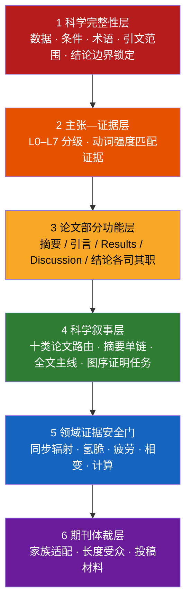

<div align="center">

# Metallic Materials Academic Editor

<strong>金属材料学论文精修与科学论证技能 · 让每一个结论都站在证据上</strong>

<em>A scientifically constrained AI editing skill for metallic-materials manuscripts — from sentence polish to full-paper argumentation, abstract reconstruction, journal-format adaptation, and submission packages.</em>

[](CHANGELOG.md)
[](SKILL.md)


[](#参与共建)

[快速开始](#快速开始) · [核心能力](#核心能力) · [摘要单链](#6-摘要核心发现单链精修新增) · [期刊覆盖](#7-按真实顶刊体裁适配) · [工作原理](#工作原理) · [文件地图](#文件地图)

</div>

---

## 这是什么

一个面向**金属材料学**（物理冶金、相变析出、变形机制、疲劳断裂、氢脆环境损伤、高温蠕变、增材制造、表征方法、计算材料学）的学术编辑技能。可加载到 Claude、Cursor 等支持 Agent Skill 的工具中，也可直接使用仓库内提示词。

它与通用“论文润色 prompt”的根本区别：**先审证据，再动语言；先提取科学主张，再组织故事。**

> 通用润色器为了流畅会把 *A was accompanied by B* 写成 *A led to B*。语言变得顺滑，科学结论却被静默加强。本技能内置 L0–L7 主张—证据分级、领域安全门、论文类型路由和摘要增量检查，保证润色后的因果动词与原文证据相匹配。

## 为什么需要它

金属材料论文被拒或大修时，语言往往只是表层问题：

| 审稿人意见 | 背后的结构问题 | 本技能对应模块 |
|---|---|---|
| “The mechanism is overclaimed.” | 峰宽被直接写成位错密度；断口被单独指定为 HEDE | 领域证据安全门 |
| “Results and Discussion are redundant.” | 因果结论散落在 Results，Discussion 复述数据 | Results–Discussion 第一性原理分工 |
| “The comparison is not valid.” | 文献疲劳数据混用不同 R、频率和寿命定义 | 性能基准可比性核查 |
| “The story is hard to follow.” | 图按 TEM/XRD/DFT 工具堆叠，不按科学问题排列 | 全文主线与图序诊断 |
| “The main finding is buried in the abstract.” | 核心句被方法、数值和组织清单淹没；后半段复述常识 | 摘要核心发现单链精修 |
| “Not suitable for this journal.” | Elsevier 式技术摘要投给 Nature 系 | 目标期刊适配 |

## 核心能力

### 1. 科学内容保护（底线层）

数值、单位、材料状态、测试条件、术语、图表指向、引文范围和结论强度全部锁定。缺失环节不静默补写，进入“需作者确认的问题”清单。

### 2. 主张—证据分级（L0–L7）

每个句子先分级再选动词：

```text
L1 直接观察   was observed / was measured
L3 关联共现   was associated with / coincided with     ← 只有同步变化时的上限
L5 机制因果   led to / resulted in / induced           ← 需要中间过程证据
L6 控制主导   controlled / governed / dominated        ← 需排除主要替代解释
```

润色只能保持或降低不受支持的强度，从不自动升级。

### 3. 十类论文叙事路由

按核心科学问题（不是标题关键词）判定主线：组织演化 M、性能设计 P、变形分配 D、疲劳断裂 F、氢脆环境 E、高温蠕变 T、加工制造 A、表征方法 Q、计算模型 C、综述 R。混合论文强制单主线。

### 4. Results–Discussion 第一性原理分工

归属由“结论离原始数据的距离”决定：当前图表可直接核查的局部判断留在 Results；需要跨图、跨尺度、模型和文献联合的完整机制进入 Discussion。因果不因章节名自动合法或非法。

### 5. 领域证据安全门

针对金属材料高风险推断的专门核查：同步辐射晶格应变与峰宽解释、氢脆机制识别（HELP/HEDE/氢化物）、疲劳驱动力可比性（ΔK/Kmax/R）、相变快照与动力学、DFT 与实际路径、性能文献基准。

### 6. 摘要核心发现单链精修（新增）

新增可显式选择的摘要模式：

```text
摘要精修模式：自动 / 标准功能型 / 核心发现单链（Mo式逻辑）
```

“Mo式逻辑”只指一种抽象结构，不复制任何参考论文的原句、机制或数据排列：

```text
S1 研究价值
→ S2 已知边界与精确缺口
→ S3 一句话最高层级核心发现
→ S4 本文把该发现解析到什么机制深度
→ 每句只增加一个新机制环节或定量后果
→ 倒数第二句形成物理落点
→ 末句提升为受边界约束的认识
```

该模式专门处理：

- S3 被方法、完整工艺、多个数值和组织清单压垮；
- 摘要后半先复述领域常识，真正增量出现过晚；
- S4 只写“使用某方法研究”，没有机制范围；
- TEM、XRD、DFT 各占一句，证据没有沿科学箭头连接；
- 显微观察停在位错、峰宽或局部应变，缺少上位物理过程；
- 倒数第二句没有落脚点，末句只写 `provide a new strategy`；
- 性能摘要未找到最上游的新关系，或 P1/P2 没有在综合指标或性能权衡处汇合。

自动模式先判断全文是否存在一条得到证据闭合的上位关系。存在独立第二主线、证据断裂或贡献天然需要平行分类时，退回标准功能型摘要，不强行生成单链。

完整规则与专用提示词：

- [`references/ABSTRACT_CORE_CLAIM_MODE.md`](references/ABSTRACT_CORE_CLAIM_MODE.md)
- [`references/ABSTRACT_MODELS.md`](references/ABSTRACT_MODELS.md)
- [`references/PROMPT_ABSTRACT_CORE_CLAIM.md`](references/PROMPT_ABSTRACT_CORE_CLAIM.md)

### 7. 按真实顶刊体裁适配

依据期刊公开 Guide for Authors 整理成可执行规则：

| 期刊家族 | 代表期刊 | 体裁要点 |
|---|---|---|
| Nature 系 | Nature, Nat. Mater., Nat. Commun. | ≤200 词跨学科引导段；“Here we show”；数值后移 |
| Science 系 | Science, Sci. Adv. | ≤125 词摘要（背景→进展→展望）；≤125 字符一句话总结 |
| Elsevier 全长文 | Acta Mater., IJP, JMST, MSEA, Corros. Sci., Int. J. Fatigue, Addit. Manuf. | ≤250 词事实型摘要；PSPP 链条可见；约 11,000 词/12 图软上限 |
| 快报 | Scripta Mater., Mater. Res. Lett. | 单一发现；≤2500 词；≤5 图 |
| 长综述 | Prog. Mater. Sci., MSE-R | 分类框架 + 判据 + 证据冲突 + 路线图 |

体裁适配只重排、压缩和调整受众层次，科学内容一个字不加。

### 8. 投稿全流程材料

- **Highlights**：3–5 条、每条 ≤85 字符（含空格）、逐条报告字符数；
- **Cover Letter**：250–450 词，写“认识增量”而非复述摘要；
- **图形摘要设计稿**：面板规划 + 每面板标签，机制示意受证据等级约束；
- **一句话总结 / 意义陈述**：字符数和词数逐一核对。

所有投稿材料与正文共享同一主张集合：正文写 `suggests`，Highlights 不写 `demonstrates`。

### 9. 领域书写规范

非母语作者高频问题的系统清单：图表引用句式、时态规范、相名称冠词、单位与晶体学记法、中译英陷阱、悬垂修饰、指代和评价词强度。

## 快速开始

### 方式一：作为 Agent Skill 使用（推荐）

将本仓库放入技能目录（如 Claude Code 的 `~/.claude/skills/` 或项目 `.cursor/skills/`），技能会按任务自动加载对应参考文件。

四种零配置用法：

```text
① 直接粘贴论文文本                 → 自动判定部分/类型/强度
② 粘贴文本 + “投 Acta Materialia”   → 精修 + 期刊体裁适配
③ “基于这篇摘要写 Highlights”      → 投稿材料 + 证据比对
④ “按核心发现单链重构这个摘要”     → S1–S4 + 增量链 + 物理落点
```

### 方式二：直接使用提示词

无法加载技能时，复制以下任一提示词：

- [`references/PROMPT_FULL.md`](references/PROMPT_FULL.md)：通用完整版；
- [`references/PROMPT_COMPACT.md`](references/PROMPT_COMPACT.md)：日常精简版；
- [`references/PROMPT_ABSTRACT_CORE_CLAIM.md`](references/PROMPT_ABSTRACT_CORE_CLAIM.md)：摘要核心发现单链专用版。

### 进阶：摘要单链精细控制

```text
目标语言：英文
文本所属部分：摘要
主要论文类型：自动判定
任务类型：摘要重构
摘要精修模式：核心发现单链（Mo式逻辑）
目标期刊：Acta Materialia
润色强度：深度学术重写
架构干预：在原文证据链内重排
输出模式：完整模式

作者希望读者最终记住的科学关系：
[填写；未填写时由技能提取]

待处理文本：
[粘贴摘要；也可附 Results、Discussion 和 Conclusion 供证据映射]
```

完整字段见 [`references/INPUT_TEMPLATE.md`](references/INPUT_TEMPLATE.md)。

## 工作原理

六层相互约束的架构，低层永远压制高层：



完整模式通常输出：精修稿 → 关键修改说明 → 需作者确认的问题 → 科学叙事诊断 → Results–Discussion 诊断。启用摘要核心发现单链时，追加一句话核心发现及证据等级、S1–Sn 功能映射、逐句问题接力和新信息审计。

## 与通用润色的对比

| 维度 | 通用润色 prompt | 本技能 |
|---|---|---|
| 因果动词 | 为流畅随意升级 | 按 L0–L7 分级，只降不升 |
| 缺失环节 | 靠常识补写 | 列入作者确认项，从不虚构 |
| 摘要中心 | 数据、方法和结果的压缩清单 | 唯一核心发现 + 逐句增量链 |
| Results/Discussion | 不区分 | 按证据距离逐句归属 |
| 领域推断 | 峰宽=位错密度、断口=机制 | 专门安全门拦截 |
| 期刊差异 | 一套文风走天下 | 按 Nature/Science/Acta/Scripta 家族体裁适配 |
| 投稿材料 | 无 | Highlights/Cover Letter/图形摘要 + 证据比对 |
| 文献比较 | 直接保留 | 核对 R、频率、温度、寿命定义等可比性 |

## 文件地图

```text
├── SKILL.md                              技能主文件：六层架构 + 执行规则
├── CHANGELOG.md                          版本演进
└── references/
    ├── PAPER_TYPE_ROUTING.md             十类论文主线与混合类型路由
    ├── ARCHITECTURE_RULES.md             全文叙事、图序、跨部分一致性
    ├── RESULTS_DISCUSSION_LOGIC.md       Results–Discussion 第一性原理分工
    ├── PERFORMANCE_PAPER_LOGIC.md        性能类双链逻辑
    ├── CLAIM_EVIDENCE_MATRIX.md          L0–L7 证据等级与动词强度
    ├── DOMAIN_EVIDENCE_MODULES.md        分领域证据边界
    ├── JOURNAL_ADAPTATION.md             目标期刊家族适配
    ├── SUBMISSION_PACKAGE.md             Highlights/Cover Letter/图形摘要
    ├── LANGUAGE_PITFALLS.md              高频语言问题与书写规范
    ├── ABSTRACT_MODELS.md                摘要模式路由与各类型功能模型
    ├── ABSTRACT_CORE_CLAIM_MODE.md       核心发现单链完整规则
    ├── PROMPT_ABSTRACT_CORE_CLAIM.md     摘要单链专用提示词
    ├── CORPUS_STYLE_NOTES.md             句级语言标定
    ├── WORKED_BLUEPRINTS.md              研究结构蓝图
    ├── PROMPT_FULL.md                    通用完整版提示词
    ├── PROMPT_COMPACT.md                 日常精简版提示词
    ├── INPUT_TEMPLATE.md                 精细控制输入模板
    └── QUALITY_CHECKLIST.md              提交前逐项核查表
```

## 设计原则：明确不做的事

- 不补写未提供的实验数据、统计结果或文献；
- 不为缺失环节发明机制，不把快照写成动力学；
- 不把断口形貌、峰宽变化、同步共现直接指定为唯一机制；
- 不为获得“锋利摘要”把并列观察强行生成单链；
- 不复制任何范文的可识别词句、固定结构、具体机制或数据排列；
- 不替作者完成需要新增实验、计算或统计才能完成的科学判定。

本技能负责表达、论证结构和证据边界；科学判断属于作者。

## 版本演进

| 版本 | 定位 |
|---|---|
| Unreleased | 摘要核心发现单链：S1–S4 功能契约、新信息门、问题接力和物理落点 |
| v5.0.0 | 真实顶刊体裁对齐 + 投稿全流程材料 + 领域书写规范 |
| v4.0.0 | 金属材料学通用化：十类路由、L0–L7 证据矩阵、Results–Discussion 分工 |
| v3.0 | 全文主线、过程轨迹、理论—观察配对 |
| v2 及更早 | 断裂力学倾向的语言精修器 |

详见 [`CHANGELOG.md`](CHANGELOG.md)。

## 参与共建

欢迎通过 Issue 与 PR 参与：

- **新领域模块**：钛合金氢化物、高熵合金短程序、镁合金孪生等方向的证据边界清单；
- **期刊适配档案**：更多期刊体裁参数；
- **失败案例**：摘要核心句过载、因果升级和结果复述常识的真实反例。

> 期刊格式数值以各期刊官网当期 Guide for Authors 为准；仓库整理值只作编辑起点。

---

<div align="center">

<strong>如果这个项目帮你避免了一次 overclaimed mechanism，欢迎点一颗 Star。</strong>

<em>Built for metallurgists who believe language should never outrun evidence.</em>

</div>
