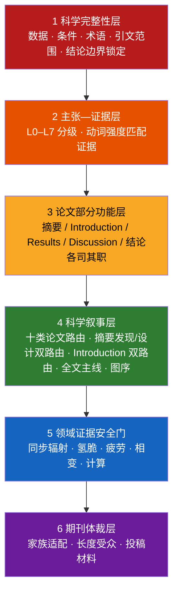

<div align="center">

# Metallic Materials Academic Editor

<strong>金属材料学论文精修与科学论证技能 · 让每一个结论都站在证据上</strong>

<em>A scientifically constrained AI editing skill for metallic-materials manuscripts — with dedicated Abstract, Introduction, Results, Discussion, Conclusion, and full-text modes.</em>

[](CHANGELOG.md)
[](SKILL.md)


[](#参与共建)

[快速开始](#快速开始) · [核心能力](#核心能力) · [六种模式](#3-六种-section-mode-路由) · [摘要双路由](#7-摘要发现设计双路由精修) · [Introduction 专用](#8-introduction-专用双路由重构) · [工作原理](#工作原理) · [文件地图](#文件地图)

</div>

---

## 这是什么

一个面向**金属材料学**（物理冶金、相变析出、变形机制、疲劳断裂、氢脆环境损伤、高温蠕变、增材制造、表征方法、计算材料学）的学术编辑技能。可加载到 Claude、Cursor 等支持 Agent Skill 的工具中，也可直接使用仓库内提示词。

它与通用“论文润色 prompt”的根本区别：**先确定当前 section 的职责和证据权限，再动语言；上下文不足时明确降级，不把局部润色伪装成全文审计。**

> 通用润色器为了流畅会把 *A was accompanied by B* 写成 *A led to B*。语言变得顺滑，科学结论却被静默加强。本技能内置六种 section mode、L0–L7 主张—证据分级、上下文覆盖声明和失败闭合门，保证输出不会越过原文证据或所提供章节。

## 为什么需要它

金属材料论文被拒或大修时，语言往往只是表层问题：

| 审稿人意见 | 背后的结构问题 | 本技能对应模块 |
|---|---|---|
| “The mechanism is overclaimed.” | 峰宽被直接写成位错密度；断口被单独指定为 HEDE | 领域证据安全门 |
| “Results and Discussion are redundant.” | 因果结论散落在 Results，Discussion 复述数据 | Results–Discussion 第一性原理分工 |
| “The comparison is not valid.” | 文献疲劳数据混用不同 R、频率和寿命定义 | 性能基准可比性核查 |
| “The story is hard to follow.” | 图按 TEM/XRD/DFT 工具堆叠，不按科学问题排列 | 全文主线与图序诊断 |
| “The main finding is buried in the abstract.” | 核心句被方法、数值和组织清单淹没 | 发现导向单链 |
| “The abstract reports properties but not a design principle.” | 工艺—组织—性能罗列，缺少中间变量和代价抑制 | 设计/解决导向链 |
| “The Introduction is broad but the gap is vague.” | 背景和文献很多，缺口与本文贡献不在同一层级 | Introduction 专用双路由重构 |
| “Not suitable for this journal.” | Elsevier 式技术摘要投给 Nature 系 | 目标期刊适配 |

## 核心能力

### 1. 科学内容保护（底线层）

数值、单位、材料状态、测试条件、术语、图表指向、引文范围和结论强度全部锁定。缺失环节不静默补写，进入“需作者确认的问题”清单。

### 2. 主张—证据分级（L0–L7）

每个句子先分级再选动词：

```text
L1 直接观察   was observed / was measured
L3 关联共现   was associated with / coincided with
L5 机制因果   led to / resulted in / induced
L6 控制主导   controlled / governed / dominated
```

润色只能保持或降低不受支持的强度，从不自动升级。设计动词同样受约束：`enables` 需要“设计动作—中间状态—结果”闭合，`solves`、`overcomes` 和 `eliminates` 需要更完整的边界验证。

### 3. 六种 section mode 路由

用户只需说明“处理哪一部分、做什么”。技能将请求规范化为三个轴：

```text
section_mode: abstract | introduction | results | discussion | conclusion | full
operation: polish | rewrite | diagnose | restructure | consistency
context_level: local | partial | full  # 由实际章节和 ledger 计算
```

| 模式 | 独立职责 | 关键安全门 |
|---|---|---|
| Abstract | 压缩核心主张并选择 standard/discovery/design 路线 | 只有摘要时不声称已与全文一致 |
| Introduction | 从贡献反推精确缺口、必要性和证据路线 | 不把未知文献状态或缺失机制写成事实 |
| Results | 报告直接证据、定量关系与最强局部判断 | 缺条件、基准或证据定位时不升级结论 |
| Discussion | 联合证据闭合机制箭头、替代解释和边界 | 无 Results/EvidenceRecord 时不生成机制性重写 |
| Conclusion | 按正文顺序回收已建立主张 | 无正文/ledger 时只做局部语言精修 |
| Full text | 管理 claim ledger、章节归属、顺序和跨章节一致性 | 缺核心章节时只报告 partial，不冒充全文通过 |

用户可以填写 `requested_context_level` 表示希望检查的范围，但不能自行把覆盖度声明为 full。每次模式完整输出都会给出统一 `route_decision`，其中包含实际 `context_level`、`coverage`、`not_checked`、`status` 和 `blockers`。完整契约见 [`references/SECTION_MODE_ROUTER.md`](references/SECTION_MODE_ROUTER.md)。旧字段“文本所属部分”“任务类型”“完整模式”继续兼容。

### 4. 十类论文叙事路由

按核心科学问题判定主线：组织演化 M、性能设计 P、变形分配 D、疲劳断裂 F、氢脆环境 E、高温蠕变 T、加工制造 A、表征方法 Q、计算模型 C、综述 R。混合论文强制单主线。

### 5. Results–Discussion 第一性原理分工

归属由“结论离原始数据的距离”决定：当前图表可直接核查的局部判断留在 Results；需要跨图、跨尺度、模型和文献联合的完整机制进入 Discussion。因果不因章节名自动合法或非法。

### 6. 领域证据安全门

针对金属材料高风险推断的专门核查：同步辐射晶格应变与峰宽解释、氢脆机制识别（HELP/HEDE/氢化物）、疲劳驱动力可比性（ΔK/Kmax/R）、相变快照与动力学、DFT 与实际路径、性能文献基准。

### 7. 摘要发现/设计双路由精修

摘要可以显式选择：

```text
摘要精修模式：
自动
/ 标准功能型
/ 发现导向单链（核心发现单链 / Mo式逻辑）
/ 设计/解决导向链
```

#### 发现导向

核心是“我们看到了或理解了以前不清楚的东西”：

```text
研究价值
→ 已知边界与精确知识缺口
→ 一句话最高层级核心发现
→ 机制解析深度
→ 每句只增加一个新机制环节
→ 物理落点
→ 受边界约束的认识
```

适用于相变、形核长大、变形机制、环境损伤、定量机制归因等研究。

完整规则与提示词：

- [`references/ABSTRACT_CORE_CLAIM_MODE.md`](references/ABSTRACT_CORE_CLAIM_MODE.md)
- [`references/PROMPT_ABSTRACT_CORE_CLAIM.md`](references/PROMPT_ABSTRACT_CORE_CLAIM.md)

#### 设计/解决导向

核心是“我们通过可控设计实现了以前难以获得的能力”：

```text
目标能力
→ 现有能力缺口或性能权衡
→ 一句话核心解决方案
→ 设计实现机制
→ 关键中间变量
→ 目标组织/状态
→ 定量性能
→ P1/P2 机制与代价抑制
→ 受边界约束的设计认识
```

该模式强制闭合两条链：

```text
解决链：
需求 → 瓶颈 → 设计 → 中间变量 → 组织 → 性能

解释链：
组织 → P1 → P2/代价抑制 → 综合能力
```

适用于强塑协同、强韧协同、低模量—高疲劳、抗氢脆—高强度、缺陷控制、功能范围调控和可规模化加工等研究。

完整规则与提示词：

- [`references/ABSTRACT_DESIGN_SOLUTION_MODE.md`](references/ABSTRACT_DESIGN_SOLUTION_MODE.md)
- [`references/PROMPT_ABSTRACT_DESIGN_SOLUTION.md`](references/PROMPT_ABSTRACT_DESIGN_SOLUTION.md)

#### 自动路由

自动模式执行两个删除测试：

1. 删除性能数字后，若仍有一条可独立成立的新机制关系，优先发现导向；
2. 删除完整机制后，若设计动作、目标组织和性能组合仍构成主要贡献，优先设计导向。

存在无法汇合的第二主线、证据断裂或天然平行贡献时，退回标准功能型，不强行生成单链。

### 8. Introduction 专用双路由重构

Introduction 专用模块从全文最高层贡献反向生成必要性论证。它要求在写段落前先确定八项工作变量：

```text
Y：最终解释、调节或实现的结果
A：当前最接近的共识或设计策略
C：现有认识失效的具体条件
B：精确缺失的关系、定量贡献或实现环节
X：本文发现或操控的关键变量、状态或路径
M：连接 X 与 Y 的中间过程
E：证明各箭头的证据路线
G：新增解释、预测、调控或实施能力
```

引言前半段从 `Y` 反向收缩到 `B`，末段再从 `X` 沿 `M、E、G` 正向展开：

```text
重要结果 Y
→ 当前共识 A
→ A 在条件 C 下的边界
→ 精确缺口 B
→ X → M → Y
→ 证据路线 E
→ 解释或设计能力 G
```

#### 发现导向 Introduction

适用于异常现象、隐藏前驱状态、相变或损伤路径、定量机制关系：

```text
重要现象或过程
→ 正常预期、已知初态/终态或当前解释
→ 在 C 下出现知识断点
→ 精确机制问题 B
→ 本文发现 X
→ X 通过 M 解释 Y
→ 证据与认识边界
```

#### 需求与性能导向 Introduction

适用于多性能协同、精确调控、制造实施和工业约束：

```text
目标能力 Y
→ 已知设计原理 A
→ A 在约束 C 下的实现或定量瓶颈 B
→ 可控变量 X
→ 关键中间状态 M
→ 组织、物性或性能 Y
→ 实施范围 G
```

模块优先识别四类精确缺口：

1. 正常预期与观测结果冲突；
2. 初态和终态之间的机制路径缺失；
3. 多因素贡献、符号、敏感性或耦合关系未定量；
4. 已知原理在明确工程约束下缺少可实施路径。

核心安全要求：缺口与最高层贡献处于同一逻辑层级；文献按重要性、当前共识、最近前沿和精确缺口组织；方法必须对应缺失的可观测量；引言末段与首图和正文证据顺序一致；引文重排不能扩大支撑范围。

完整规则与提示词：

- [`references/INTRODUCTION_LOGIC.md`](references/INTRODUCTION_LOGIC.md)
- [`references/PROMPT_INTRODUCTION_RECONSTRUCTION.md`](references/PROMPT_INTRODUCTION_RECONSTRUCTION.md)

### 9. 按真实顶刊体裁适配

依据期刊公开 Guide for Authors 整理成可执行规则：

| 期刊家族 | 代表期刊 | 体裁要点 |
|---|---|---|
| Nature 系 | Nature, Nat. Mater., Nat. Commun. | ≤200 词跨学科引导段；“Here we show”；数值后移 |
| Science 系 | Science, Sci. Adv. | ≤125 词摘要；≤125 字符一句话总结 |
| Elsevier 全长文 | Acta Mater., IJP, JMST, MSEA, Corros. Sci., Int. J. Fatigue, Addit. Manuf. | ≤250 词事实型摘要；PSPP 链条可见 |
| 快报 | Scripta Mater., Mater. Res. Lett. | 单一发现或单一解决方案；≤2500 词；≤5 图 |
| 长综述 | Prog. Mater. Sci., MSE-R | 分类框架 + 判据 + 证据冲突 + 路线图 |

体裁适配只重排、压缩和调整受众层次，科学内容一个字不加。

### 10. 投稿全流程材料

- **Highlights**：3–5 条、每条 ≤85 字符；
- **Cover Letter**：250–450 词，写认识或能力增量；
- **图形摘要设计稿**：面板规划 + 标签，机制示意受证据等级约束；
- **一句话总结 / 意义陈述**：字符数和词数逐一核对。

所有投稿材料与正文共享同一主张集合：正文写 `suggests`，Highlights 不写 `demonstrates`。

### 11. 领域书写规范

非母语作者高频问题的系统清单：图表引用句式、时态、相名称冠词、单位与晶体学记法、中译英陷阱、悬垂修饰、指代和评价词强度。

## 快速开始

### 方式一：作为 Agent Skill 使用

将本仓库放入技能目录，技能会按任务自动加载对应参考文件。

六种 section mode 的自然语言用法：

```text
① “按发现导向单链重构这个摘要”
② “围绕主要贡献和 new insight 重构这个 Introduction”
③ “只精修 Results，保留图号和条件，不新增机制解释”
④ “结合所附 Results 重写 Discussion，并列出每个机制箭头的证据”
⑤ “检查 Conclusion 是否新增或强化了正文没有的主张”
⑥ “审查全文主线、主张顺序和跨章节一致性；先不要跨章移动”
```

也可显式填写三轴字段：

```text
section_mode: discussion
operation: rewrite
requested_context_level: partial
```

显式 section/operation 优先，旧字段仍兼容；requested context 只是希望范围。只有实际提供完整核心章节并通过一致性门，`context_level` 与 `coverage` 才会标为 `full`。

### 方式二：直接使用提示词

- [`references/PROMPT_FULL.md`](references/PROMPT_FULL.md)：通用完整版；
- [`references/PROMPT_COMPACT.md`](references/PROMPT_COMPACT.md)：日常精简版；
- [`references/PROMPT_ABSTRACT_CORE_CLAIM.md`](references/PROMPT_ABSTRACT_CORE_CLAIM.md)：发现导向单链；
- [`references/PROMPT_ABSTRACT_DESIGN_SOLUTION.md`](references/PROMPT_ABSTRACT_DESIGN_SOLUTION.md)：设计/解决导向；
- [`references/PROMPT_INTRODUCTION_RECONSTRUCTION.md`](references/PROMPT_INTRODUCTION_RECONSTRUCTION.md)：Introduction 专用重构。

### 进阶：Introduction 重构

```text
目标语言：英文
文本所属部分：引言
任务类型：Introduction 重构
Introduction 模式：自动
目标期刊：Acta Materialia
润色强度：深度
输出模式：Introduction 完整模式
允许跨段重排：是

作者认定的一句话主要贡献：
Y：
A：
C：
B：
X：
M：
E1–E3：
G：

Introduction 草稿：
[粘贴文本]

可选的题目、摘要、Results、Discussion 和 Conclusion：
[粘贴文本]
```

### 进阶：设计导向摘要

```text
目标语言：英文
文本所属部分：摘要
主要论文类型：P
任务类型：摘要重构
摘要精修模式：设计/解决导向链
目标期刊：Acta Materialia
润色强度：深度
输出模式：完整模式

应用或材料能力需求：
现有路线的具体瓶颈：
作者采用的可控设计变量：
设计建立的关键中间变量：
目标组织或状态：
必须保留的性能及测试条件：
主要 benchmark：
P1 的来源：
P2 或通常代价被抑制的原因：

待处理文本：
[粘贴摘要；也可附 Results、Discussion 和 Conclusion]
```

完整字段见 [`references/INPUT_TEMPLATE.md`](references/INPUT_TEMPLATE.md)。

### 验证与边界

```powershell
npm ci
npm test
```

自动验证检查 Agent Skill 元数据、Markdown 引用、六种 mode 的 manifest 契约、别名归一化、固定输出/gate 字段和 Markdown 格式。它不读取真实论文证据，也不能自动证明某个机制、主张或全文一致性成立；这类判断仍必须由当前 mode 按实际 `coverage`、ClaimRecord/EvidenceRecord 和 fail-closed 规则执行。

## 工作原理

六层相互约束的架构，低层永远压制高层：



模式完整输出通常为：`route_decision` → 当前 section 的稿件或诊断 → 关键修改说明 → 主张/功能映射 → 需作者确认项 → 未执行检查。只有 `section_mode=full` 且覆盖度真实达到 `full` 时，才追加全文科学叙事和 Results–Discussion 一致性诊断。

发现导向摘要追加：核心发现、S1–Sn 功能映射、新信息审计、核心动词边界。

设计导向摘要追加：核心解决方案、设计类型、解决链、解释链、benchmark 审计和发现导向备选诊断。

Introduction 完整模式追加：一句话核心新认识、`Y/A/C/B/X/M/E/G`、主路由、精确缺口类型、段落功能映射和缺口—贡献同级检查；引文与正文闭合只检查实际提供的材料。

## 与通用润色的对比

| 维度 | 通用润色 prompt | 本技能 |
|---|---|---|
| 因果动词 | 为流畅随意升级 | 按 L0–L7 分级 |
| 缺失环节 | 靠常识补写 | 列入作者确认项 |
| 摘要中心 | 数据、方法和结果的压缩清单 | 发现单链或设计双闭环 |
| Introduction | 背景扩写 + `remains unclear` | 从最高层贡献反推精确缺口和证据路线 |
| 性能摘要 | 工艺—组织—性能罗列 | 解决链 + 解释链 |
| Results/Discussion | 不区分 | 按证据距离逐句归属 |
| 领域推断 | 峰宽=位错密度、断口=机制 | 专门安全门拦截 |
| 期刊差异 | 一套文风走天下 | 按期刊家族适配 |
| 投稿材料 | 无 | 投稿包 + 证据比对 |
| 文献比较 | 直接保留 | 核对测试条件和口径 |

## 文件地图

```text
├── SKILL.md
├── CHANGELOG.md
├── scripts/
│   └── validate-skill.mjs
├── tests/
│   └── section-mode-fixtures.json
└── references/
    ├── SECTION_MODE_ROUTER.md
    ├── SECTION_MODE_MANIFEST.json
    ├── ABSTRACT_MODE.md
    ├── INTRODUCTION_MODE.md
    ├── RESULTS_MODE.md
    ├── DISCUSSION_MODE.md
    ├── CONCLUSION_MODE.md
    ├── FULL_TEXT_MODE.md
    ├── PAPER_TYPE_ROUTING.md
    ├── ARCHITECTURE_RULES.md
    ├── INTRODUCTION_LOGIC.md
    ├── PROMPT_INTRODUCTION_RECONSTRUCTION.md
    ├── RESULTS_DISCUSSION_LOGIC.md
    ├── PERFORMANCE_PAPER_LOGIC.md
    ├── CLAIM_EVIDENCE_MATRIX.md
    ├── DOMAIN_EVIDENCE_MODULES.md
    ├── JOURNAL_ADAPTATION.md
    ├── SUBMISSION_PACKAGE.md
    ├── LANGUAGE_PITFALLS.md
    ├── ABSTRACT_MODELS.md
    ├── ABSTRACT_CORE_CLAIM_MODE.md
    ├── ABSTRACT_DESIGN_SOLUTION_MODE.md
    ├── PROMPT_ABSTRACT_CORE_CLAIM.md
    ├── PROMPT_ABSTRACT_DESIGN_SOLUTION.md
    ├── CORPUS_STYLE_NOTES.md
    ├── WORKED_BLUEPRINTS.md
    ├── PROMPT_FULL.md
    ├── PROMPT_COMPACT.md
    ├── INPUT_TEMPLATE.md
    └── QUALITY_CHECKLIST.md
```

## 设计原则：明确不做的事

- 不补写未提供的实验数据、统计结果或文献；
- 不为缺失环节发明机制，不把快照写成动力学；
- 不把断口、峰宽、同步共现直接指定为唯一机制；
- 不为获得锋利摘要把并列观察强行生成发现链；
- 不为获得设计故事把普通制样工艺包装成解决方案；
- 不为增强 Introduction 必要性夸大整个领域的知识缺口；
- 不移动引文后扩大其实际支撑命题；
- 不把单一材料或单一条件外推为普适设计准则；
- 不复制任何范文的可识别词句、机制、工艺或数据排列；
- 不替作者完成需要新增实验、计算或统计的科学判定。

## 版本演进

| 版本 | 定位 |
|---|---|
| Unreleased | 六种 section mode + 上下文覆盖/失败闭合 + 摘要与 Introduction 专用路由 |
| v5.0.0 | 真实顶刊体裁对齐 + 投稿全流程材料 + 领域书写规范 |
| v4.0.0 | 金属材料学通用化：十类路由、证据矩阵、Results–Discussion 分工 |
| v3.0 | 全文主线、过程轨迹、理论—观察配对 |
| v2 及更早 | 断裂力学倾向的语言精修器 |

详见 [`CHANGELOG.md`](CHANGELOG.md)。

## 参与共建

欢迎通过 Issue 与 PR 参与：

- **新领域模块**：钛合金氢化物、高熵合金短程序、镁合金孪生等证据边界；
- **期刊适配档案**：更多期刊体裁参数；
- **失败案例**：发现句过载、设计链断裂、Introduction 缺口过宽、性能比较失真和因果升级反例。

> 期刊格式数值以各期刊官网当期 Guide for Authors 为准；仓库整理值只作编辑起点。

---

<div align="center">

<strong>如果这个项目帮你避免了一次 overclaimed mechanism，欢迎点一颗 Star。</strong>

<em>Built for metallurgists who believe language should never outrun evidence.</em>

</div>
