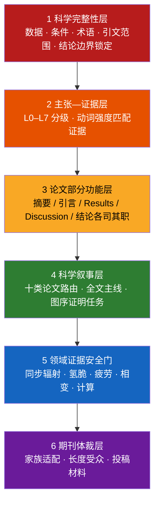

<div align="center">

# Metallic Materials Academic Editor

<strong>金属材料学论文精修与科学论证技能 · 让每一个结论都站在证据上</strong>

<em>A scientifically constrained AI editing skill for metallic-materials manuscripts — from sentence polish to full-paper argumentation, journal-format adaptation, and submission packages.</em>

[](CHANGELOG.md)
[](SKILL.md)


[](#参与共建)

[快速开始](#快速开始) · [核心能力](#核心能力) · [期刊覆盖](#6-按真实顶刊体裁适配v5-新增) · [工作原理](#工作原理) · [文件地图](#文件地图)

</div>

---

## 这是什么

一个面向**金属材料学**（物理冶金、相变析出、变形机制、疲劳断裂、氢脆环境损伤、高温蠕变、增材制造、表征方法、计算材料学）的学术编辑技能。可加载到 Claude、Cursor 等支持 Agent Skill 的工具中，也可直接使用仓库内提示词。

它与通用"论文润色 prompt"的根本区别：**先审证据，再动语言**。

> 通用润色器为了流畅会把 *"A was accompanied by B"* 写成 *"A led to B"* —— 这在语言上是升级，在科学上是造假。本技能内置 L0–L7 主张—证据分级、领域安全门和期刊体裁规则，保证润色后的每一个因果动词都有原文证据支撑。

## 为什么需要它

金属材料论文被拒或大修，语言只是表因，常见的真正问题是：

| 审稿人意见 | 背后的结构问题 | 本技能对应模块 |
|---|---|---|
| "The mechanism is overclaimed." | 峰宽被直接写成位错密度；断口被单独指定为 HEDE | 领域证据安全门 |
| "Results and Discussion are redundant." | 因果结论散落在 Results，Discussion 复述数据 | Results–Discussion 第一性原理分工 |
| "The comparison is not valid." | 文献疲劳数据混用不同 R、频率和寿命定义 | 性能基准可比性核查 |
| "The story is hard to follow." | 图按 TEM/XRD/DFT 工具堆叠，不按科学问题排列 | 全文主线与图序诊断 |
| "Not suitable for this journal." | Elsevier 式技术摘要投给 Nature 系 | 目标期刊适配（v5 新增） |

## 核心能力

### 1. 科学内容保护（底线层）

数值、单位、材料状态、测试条件、术语、图表指向、引文范围、结论强度全部锁定。缺失环节不静默补写，进入"需作者确认的问题"清单。

### 2. 主张—证据分级（L0–L7）

每个句子先分级再选动词：

```
L1 直接观察   was observed / was measured
L3 关联共现   was associated with / coincided with     ← 只有同步变化时的上限
L5 机制因果   led to / resulted in / induced           ← 需要中间过程证据
L6 控制主导   controlled / governed / dominated        ← 需排除主要替代解释
```

润色只能保持或降低不受支持的强度，从不自动升级。

### 3. 十类论文叙事路由

按核心科学问题（不是标题关键词）判定主线：组织演化 M、性能设计 P、变形分配 D、疲劳断裂 F、氢脆环境 E、高温蠕变 T、加工制造 A、表征方法 Q、计算模型 C、综述 R。混合论文强制单主线。

### 4. Results–Discussion 第一性原理分工

归属由"结论离原始数据的距离"决定：当前图表可直接核查的局部判断留在 Results；需要跨图、跨尺度、模型和文献联合的完整机制进入 Discussion。因果不因章节名自动合法或非法。

### 5. 领域证据安全门

针对金属材料高风险推断的专门核查：同步辐射晶格应变与峰宽解释、氢脆机制识别（HELP/HEDE/氢化物）、疲劳驱动力可比性（ΔK/Kmax/R）、相变快照与动力学、DFT 与实际路径、性能文献基准。

### 6. 按真实顶刊体裁适配（v5 新增）

依据期刊公开的 Guide for Authors 整理成可执行规则：

| 期刊家族 | 代表期刊 | 体裁要点 |
|---|---|---|
| Nature 系 | Nature, Nat. Mater., Nat. Commun. | ≤200 词跨学科引导段；"Here we show"；数值后移 |
| Science 系 | Science, Sci. Adv. | ≤125 词摘要（背景→进展→展望）；≤125 字符一句话总结 |
| Elsevier 全长文 | Acta Mater., IJP, JMST, MSEA, Corros. Sci., Int. J. Fatigue, Addit. Manuf. | ≤250 词事实型摘要；PSPP 链条可见；约 11,000 词/12 图软上限 |
| 快报 | Scripta Mater., Mater. Res. Lett. | 单一发现；≤2500 词；≤5 图 |
| 长综述 | Prog. Mater. Sci., MSE-R | 分类框架 + 判据 + 证据冲突 + 路线图 |

体裁适配只重排、压缩、调整受众层次 —— 科学内容一个字不加。

### 7. 投稿全流程材料（v5 新增）

- **Highlights**：3–5 条、每条 ≤85 字符（含空格）、逐条报告字符数；
- **Cover Letter**：250–450 词，写"认识增量"而非复述摘要；
- **图形摘要设计稿**：面板规划 + 标签文案，机制示意受证据等级约束；
- **一句话总结 / 意义陈述**：字符数逐一核对。

所有投稿材料与正文共享同一主张集合：正文写 `suggests`，Highlights 绝不写 `demonstrates`。

### 8. 领域书写规范（v5 新增）

非母语作者高频问题的系统清单：图表引用句式（消灭 *"It can be seen from Fig. 2 that..."*）、时态规范、相名称冠词、单位与晶体学记法（`{111}`、`⟨110⟩`、`(0001)α ∥ {110}β`）、中译英陷阱对照（组织 ≠ organization）。

## 快速开始

### 方式一：作为 Agent Skill 使用（推荐）

将本仓库放入技能目录（如 Claude Code 的 `~/.claude/skills/` 或项目 `.cursor/skills/`），技能会按任务自动加载对应参考文件。

三种零配置用法：

```text
① 直接粘贴论文文本            → 自动判定部分/类型/强度，输出精修稿 + 诊断
② 粘贴文本 + "投 Acta Materialia" → 精修 + 期刊体裁适配
③ "基于这篇摘要写 Highlights"   → 投稿材料 + 逐条证据比对 + 字符数核对
```

### 方式二：直接使用提示词

无法加载技能时，复制 [`references/PROMPT_FULL.md`](references/PROMPT_FULL.md)（完整版）或 [`references/PROMPT_COMPACT.md`](references/PROMPT_COMPACT.md)（日常版）到任意大模型对话中。

### 进阶：精细控制

```text
目标语言：英文
文本所属部分：讨论
任务类型：Results–Discussion 分工
润色强度：中度逻辑与语言优化
架构干预：仅诊断
目标期刊：Acta Materialia
输出模式：完整模式

待处理文本：
[粘贴文本]
```

完整字段见 [`references/INPUT_TEMPLATE.md`](references/INPUT_TEMPLATE.md)。

## 工作原理

六层相互约束的架构，低层永远压制高层：



输出采用**完整模式**时包含五个部分：精修稿 → 关键修改说明 → 需作者确认的问题 → 科学叙事诊断 → Results–Discussion 诊断。

## 与通用润色的对比

| 维度 | 通用润色 prompt | 本技能 |
|---|---|---|
| 因果动词 | 为流畅随意升级 | 按 L0–L7 分级，只降不升 |
| 缺失环节 | 靠常识补写 | 列入作者确认项，从不虚构 |
| Results/Discussion | 不区分 | 按证据距离逐句归属 |
| 领域推断 | 峰宽=位错密度、断口=机制 | 专门安全门拦截 |
| 期刊差异 | 一套文风走天下 | 按 Nature/Science/Acta/Scripta 家族体裁适配 |
| 投稿材料 | 无 | Highlights/Cover Letter/图形摘要文案 + 证据比对 |
| 文献比较 | 直接保留 | 核对 R、频率、温度、寿命定义等可比性 |

## 文件地图

```text
├── SKILL.md                              技能主文件：六层架构 + 执行规则 + 快速开始
├── CHANGELOG.md                          版本演进（v5 更新说明）
└── references/
    ├── PAPER_TYPE_ROUTING.md             十类论文主线与混合类型路由
    ├── ARCHITECTURE_RULES.md             全文叙事、图序、跨部分一致性
    ├── RESULTS_DISCUSSION_LOGIC.md       Results–Discussion 第一性原理分工
    ├── PERFORMANCE_PAPER_LOGIC.md        性能类论文双链逻辑（收益链 + 代价抑制链）
    ├── CLAIM_EVIDENCE_MATRIX.md          L0–L7 证据等级与动词强度梯度
    ├── DOMAIN_EVIDENCE_MODULES.md        分领域证据边界（同步辐射/氢脆/疲劳/蠕变/计算…）
    ├── JOURNAL_ADAPTATION.md             目标期刊家族适配（v5 新增）
    ├── SUBMISSION_PACKAGE.md             Highlights/Cover Letter/图形摘要/意义陈述（v5 新增）
    ├── LANGUAGE_PITFALLS.md              高频语言问题与领域书写规范（v5 新增）
    ├── ABSTRACT_MODELS.md                各论文类型的摘要功能骨架
    ├── CORPUS_STYLE_NOTES.md             基于经典疲劳断裂文献的句级语言标定
    ├── WORKED_BLUEPRINTS.md              含 Cu 钛合金同步辐射、氢脆等结构蓝图
    ├── PROMPT_FULL.md                    可直接粘贴的完整版提示词
    ├── PROMPT_COMPACT.md                 日常精简版提示词
    ├── INPUT_TEMPLATE.md                 精细控制输入模板
    └── QUALITY_CHECKLIST.md              提交前逐项核查表
```

## 设计原则：明确不做的事

- 不补写未提供的实验数据、统计结果或文献；
- 不为缺失环节发明机制，不把快照写成动力学；
- 不把断口形貌、峰宽变化、同步共现直接指定为唯一机制；
- 不复制任何范文的可识别词句、固定结构或具体机制表述；
- 不替作者做需要新增实验、计算或统计才能完成的科学判定。

本技能负责表达、论证结构和证据边界；科学判断永远属于作者。

## 版本演进

| 版本 | 定位 |
|---|---|
| v5.0.0 | 真实顶刊体裁对齐（Nature/Science/Acta/Scripta 家族）+ 投稿全流程材料 + 领域书写规范 |
| v4.0.0 | 金属材料学通用化：十类路由、L0–L7 证据矩阵、Results–Discussion 分工、领域安全门 |
| v3.0 | 全文主线、过程轨迹、理论—观察配对 |
| v2 及更早 | 断裂力学倾向的语言精修器 |

详见 [`CHANGELOG.md`](CHANGELOG.md)。

## 参与共建

欢迎通过 Issue 与 PR 参与：

- **新领域模块**：钛合金氢化物、高熵合金短程序、镁合金孪生等方向的证据边界清单；
- **期刊适配档案**：更多期刊的体裁参数（提交时请附 Guide for Authors 出处）；
- **失败案例**：润色工具"升级因果"的真实反例，将被纳入安全门测试集。

> 期刊格式数值（词数、图数、字符限制）以各期刊官网当期 Guide for Authors 为准；本仓库整理值仅作编辑起点，投稿前请复核。

---

<div align="center">

**如果这个项目帮你避免了一次 "overclaimed mechanism" 的审稿意见，欢迎点一颗 Star。**

*Built for metallurgists who believe language should never outrun evidence.*

</div>
