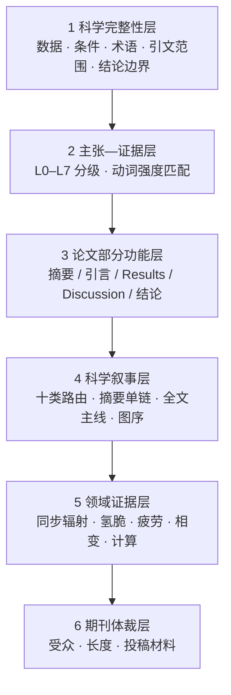

<div align="center">

# Metallic Materials Academic Editor

<strong>金属材料学论文精修与科学论证技能 · 让每一个结论都站在证据上</strong>

<em>A scientifically constrained AI editing skill for metallic-materials manuscripts — from sentence polish to full-paper argumentation, abstract reconstruction, journal-format adaptation, and submission packages.</em>

[](CHANGELOG.md)
[](SKILL.md)


[](#参与共建)

[快速开始](#快速开始) · [核心能力](#核心能力) · [摘要核心发现单链](#6-摘要核心发现单链精修新增) · [期刊覆盖](#7-按真实顶刊体裁适配) · [工作原理](#工作原理) · [文件地图](#文件地图)

</div>

---

## 这是什么

一个面向**金属材料学**的学术编辑技能，覆盖物理冶金、相变析出、变形机制、力学性能、疲劳断裂、氢脆与环境损伤、高温蠕变、增材制造、先进表征和计算材料学。它可加载到 Claude、Cursor 等支持 Agent Skill 的工具中，也可直接使用仓库内提示词。

它与通用论文润色提示词的主要区别是：**先审证据，再动语言；先提取科学主张，再组织故事。**

> 通用润色器容易把 *A was accompanied by B* 改成 *A led to B*。语言变得顺滑，科学结论却被静默加强。本技能使用 L0–L7 主张—证据分级、领域安全门和论文类型路由，限制每一个因果动词的最高强度。

## 为什么需要它

| 常见审稿意见 | 背后的结构问题 | 本技能对应模块 |
|---|---|---|
| “The mechanism is overclaimed.” | 峰宽被直接写成位错密度；断口被单独指定为 HEDE | 领域证据安全门 |
| “Results and Discussion are redundant.” | Results 已写完整机制，Discussion 又逐图复述 | Results–Discussion 第一性原理分工 |
| “The comparison is not valid.” | 不同载荷比、频率、寿命定义或试样状态被直接比较 | 性能基准可比性核查 |
| “The story is hard to follow.” | 图按 TEM/XRD/DFT 堆叠，没有证明顺序 | 全文主线与图序诊断 |
| “The main finding is buried in the abstract.” | 核心发现句被方法、数据和组织细节淹没；后半段重复常识 | 摘要核心发现单链精修 |
| “Not suitable for this journal.” | Elsevier 技术摘要直接投 Nature/Science 体裁 | 目标期刊适配 |

## 核心能力

### 1. 科学内容保护

数值、单位、材料状态、测试条件、术语、公式、图表指向、引文范围和结论强度全部锁定。缺失环节不静默补写，进入“需作者确认的问题”。

### 2. 主张—证据分级（L0–L7）

```text
L1 直接观察   was observed / was measured
L3 关联共现   was associated with / coincided with
L5 机制因果   led to / resulted in / induced
L6 控制主导   controlled / governed / dominated
```

只凭同步变化时，结论上限通常为 L3；`controlled`、`governed` 和 `dominated` 需要处理主要替代解释。

### 3. 十类论文叙事路由

按核心科学问题判定主类型：组织演化 M、性能设计 P、变形与载荷分配 D、疲劳断裂 F、氢脆与环境损伤 E、高温蠕变 T、加工制造 A、表征方法 Q、计算模型 C、综述 R。混合论文保留一条主叙事，其他类型降为证据层或后果层。

### 4. Results–Discussion 第一性原理分工

归属由“结论离原始数据的距离”决定。当前图表能够直接核查的事实、定量关系和局部判断进入 Results；需要联合多图、多尺度、模型、文献和替代解释的完整机制进入 Discussion。

### 5. 领域证据安全门

针对同步辐射晶格应变与峰宽、氢脆机制识别、疲劳驱动力可比性、相变快照与动力学、DFT 与实际路径、性能文献基准等高风险推断设置专门核查。

### 6. 摘要核心发现单链精修（新增）

新增可选模式：

```text
摘要精修模式：自动 / 标准功能型 / 核心发现单链（Mo式逻辑）
```

该模式提取高水平机制摘要中可迁移的抽象结构，不复制任何范文的原句、机制和数据排列。核心执行规则为：

```text
S1 研究价值
→ S2 已知边界与精确缺口
→ S3 一句话最高层级核心发现
→ S4 本文把该发现解析到什么机制深度
→ 每句只增加一个新机制环节或定量后果
→ 倒数第二句形成物理落点
→ 末句提升为受边界约束的认识
```

该模式重点解决：

- 第三句被方法、工艺、多个数值和组织清单压垮；
- 结果展开先复述领域常识，缺少科学增量；
- S4 只写“使用某方法研究”，没有机制范围；
- 显微观察停在位错、峰宽或局部应变，没有凝练为上位物理过程；
- 倒数第二句戛然而止，末句只写 `provide a new strategy`；
- 性能摘要未找到最上游的新关系，或未将 P1/P2 重新汇合到综合指标或性能权衡。

自动模式会先判断全文是否存在一条得到证据闭合的上位关系。存在独立第二主线、因果链断裂或贡献天然需要平行分类时，退回标准功能型摘要，不强行生成单链。

详见：

- [`references/ABSTRACT_CORE_CLAIM_MODE.md`](references/ABSTRACT_CORE_CLAIM_MODE.md)
- [`references/ABSTRACT_MODELS.md`](references/ABSTRACT_MODELS.md)
- [`references/PROMPT_ABSTRACT_CORE_CLAIM.md`](references/PROMPT_ABSTRACT_CORE_CLAIM.md)

### 7. 按真实顶刊体裁适配

| 期刊家族 | 代表期刊 | 体裁要点 |
|---|---|---|
| Nature 系 | Nature, Nat. Mater., Nat. Commun. | 跨学科引导；主要结论集中；数值后移 |
| Science 系 | Science, Sci. Adv. | ≤125 词摘要；≤125 字符一句话总结 |
| Elsevier 全长文 | Acta Mater., IJP, JMST, MSEA, Corros. Sci., Int. J. Fatigue | ≤250 词事实型摘要；PSPP 链条可见 |
| 快报 | Scripta Mater., Mater. Res. Lett. | 单一发现；极限压缩；图数受限 |
| 长综述 | Prog. Mater. Sci., MSE-R | 分类框架、判据、证据冲突和路线图 |

体裁适配只改变长度、信息顺序和受众层次，不改变科学内容。

### 8. 投稿全流程材料

- **Highlights**：3–5 条，每条 ≤85 字符并报告字符数；
- **Cover Letter**：250–450 词，突出认识增量和期刊契合度；
- **图形摘要设计稿**：面板规划与标签文案，机制示意不超过正文证据等级；
- **一句话总结 / 意义陈述**：逐项核对字符数或词数。

### 9. 金属材料领域书写规范

处理图表引用、时态、冠词、相名称、单位、晶体学记法、悬垂修饰、指代、中译英高频陷阱以及评价词强度。

## 快速开始

### 方式一：作为 Agent Skill 使用

将仓库放入技能目录。常用零配置调用：

```text
① 直接粘贴论文文本
② 粘贴文本 + “投 Acta Materialia”
③ “基于这篇摘要写 Highlights”
④ “按核心发现单链重构这个摘要”
```

### 方式二：直接使用提示词

- 通用完整版：[`references/PROMPT_FULL.md`](references/PROMPT_FULL.md)
- 日常精简版：[`references/PROMPT_COMPACT.md`](references/PROMPT_COMPACT.md)
- 摘要核心发现单链专用版：[`references/PROMPT_ABSTRACT_CORE_CLAIM.md`](references/PROMPT_ABSTRACT_CORE_CLAIM.md)

### 摘要单链精细控制示例

```text
文本所属部分：摘要
主要论文类型：自动判定
任务类型：摘要重构
摘要精修模式：核心发现单链（Mo式逻辑）
目标期刊：Acta Materialia
润色强度：深度
架构干预：在原文证据链内重排
输出模式：完整模式

作者希望读者最终记住的一句话：
[填写；未填写时由技能提取]

待处理文本：
[粘贴摘要，或提供摘要和支撑该摘要的正文结果]
```

完整字段见 [`references/INPUT_TEMPLATE.md`](references/INPUT_TEMPLATE.md)。

## 工作原理

六层约束中，低层始终压制高层：



启用摘要核心发现单链且采用完整模式时，额外输出：一句话核心发现及证据等级、S1–Sn 功能映射、逐句问题接力、新信息审计和未闭合机制环节。

## 与通用润色的对比

| 维度 | 通用润色提示词 | 本技能 |
|---|---|---|
| 因果动词 | 为流畅随意升级 | 按 L0–L7 分级，只降不升 |
| 缺失环节 | 靠常识补写 | 列入作者确认项 |
| 摘要中心 | 数据和方法的压缩清单 | 唯一核心发现 + 逐句增量链 |
| Results/Discussion | 不区分 | 按证据距离逐句归属 |
| 领域推断 | 峰宽=位错密度、断口=机制 | 专门安全门拦截 |
| 期刊差异 | 一套文风走天下 | 按期刊家族调整体裁 |
| 投稿材料 | 主张常被静默加强 | 与正文共享证据等级 |

## 文件地图

```text
├── SKILL.md                              技能主文件
├── CHANGELOG.md                          版本演进
└── references/
    ├── PAPER_TYPE_ROUTING.md             十类论文主线与混合路由
    ├── ARCHITECTURE_RULES.md             全文叙事、图序和跨部分一致性
    ├── RESULTS_DISCUSSION_LOGIC.md       Results–Discussion 分工
    ├── PERFORMANCE_PAPER_LOGIC.md        性能类双链逻辑
    ├── CLAIM_EVIDENCE_MATRIX.md          L0–L7 证据等级
    ├── DOMAIN_EVIDENCE_MODULES.md        领域证据安全门
    ├── ABSTRACT_MODELS.md                摘要模式路由与各类型骨架
    ├── ABSTRACT_CORE_CLAIM_MODE.md       摘要核心发现单链完整规则
    ├── PROMPT_ABSTRACT_CORE_CLAIM.md     摘要单链专用提示词
    ├── JOURNAL_ADAPTATION.md             目标期刊家族适配
    ├── SUBMISSION_PACKAGE.md             投稿配套材料
    ├── LANGUAGE_PITFALLS.md              高频语言问题与书写规范
    ├── CORPUS_STYLE_NOTES.md             句级语言标定
    ├── WORKED_BLUEPRINTS.md              结构蓝图
    ├── PROMPT_FULL.md                    通用完整版提示词
    ├── PROMPT_COMPACT.md                 日常精简版提示词
    ├── INPUT_TEMPLATE.md                 输入模板
    └── QUALITY_CHECKLIST.md              最终核查表
```

## 设计边界

- 不补写未提供的数据、统计结果或文献；
- 不为缺失环节发明机制，不把快照写成动力学；
- 不把断口、峰宽、同步共现或空间相邻直接指定为唯一机制；
- 不为获得“锋利摘要”把并列观察强行写成单链；
- 不复制标定论文的可识别词句、具体机制或数据排列；
- 不替作者完成需要新增实验、计算或统计的科学判定。

## 版本演进

| 版本 | 定位 |
|---|---|
| v5 摘要单链扩展 | 新增核心发现先行、S1–S4 功能契约、新信息门、问题接力和物理落点 |
| v5.0.0 | 顶刊体裁适配、投稿全流程材料、领域书写规范 |
| v4.0.0 | 金属材料学通用化、十类路由、证据矩阵、Results–Discussion 分工 |
| v3.0 | 全文主线、过程轨迹和理论—观察配对 |
| v2 及更早 | 断裂力学倾向的语言精修器 |

详见 [`CHANGELOG.md`](CHANGELOG.md)。

## 参与共建

欢迎通过 Issue 与 PR 提交新的领域证据边界、期刊体裁资料和真实失败案例。

> 期刊格式数值以各期刊官网当期 Guide for Authors 为准；仓库整理值只作为编辑起点。

---

<div align="center">

<strong>如果这个项目帮你避免了一次 overclaimed mechanism，欢迎点一颗 Star。</strong>

<em>Built for metallurgists who believe language should never outrun evidence.</em>

</div>
